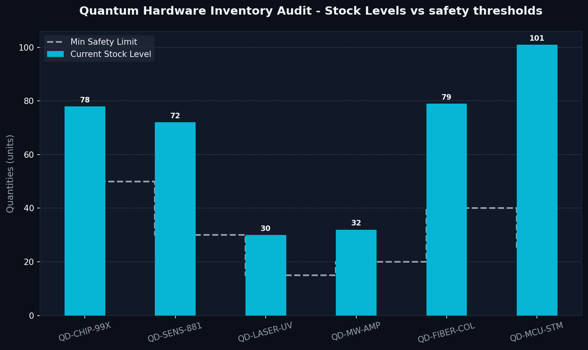

# Odoo Procurement Automator 🛡️📦

> **"I don't enter supply chain data manually, I secure data quality with code."**

For fast-growing hardware startups like **QuantumDiamonds**, the ultimate operations nightmare is data chaos and inventory discrepancies. Manual entries of delicate components (custom microchips, quantum sensors, laser optics, and microcontrollers) into ERP systems like **Odoo** lead to human error, mismatched item counts, and unexpected supply chain bottlenecks.

The **Odoo Procurement Automator** is a python ingestion pipeline. It acts as an operational shield—automatically parsing raw supplier invoices or shipping manifests of various formats (TXT, HTML, CSV), standardizing the items into Odoo-compatible import files (CSV/JSON), updating local stock registers, and automatically raising alerts for items falling below safety stock limits.

---

## Key Features

- **Multi-Format Parsing Engine (`src/parser.py`)**: RegEx and rule-based parser that handles unstructured text invoices, HTML packing manifests, and standard supplier CSV outputs.
- **Dynamic Inventory Ingestion (`src/stock_manager.py`)**: Computes new quantities, updates the virtual database, and determines safety stock status.
- **Odoo-Ready Exporter (`src/odoo_exporter.py`)**: Compiles parsed rows into official Odoo import standard CSV and JSON schemas.
- **Interactive Web Dashboard (`src/dashboard_generator.py`)**: Generates a gorgeous dark-mode dashboard (`output/procurement_dashboard.html`) featuring interactive data plots powered by Chart.js.
- **Static Plot Generator**: Saves a high-quality visualization (`output/stock_status_plot.png`) using Matplotlib for quick repository previews.
- **Rich CLI Terminal Layout**: Outputs formatted summaries, progress bars, and alert messages directly in your console.

---

## Stock Status Plot

Below is the static inventory audit chart generated automatically by the pipeline. It compares the current quantities of critical hardware components against their safety stock thresholds:



---

## Directory Structure

```text
Odoo_Procurement_Automator/
├── data/
│   ├── raw_invoices/
│   │   ├── invoice_inv2026_001.txt            # Unstructured text supplier invoice
│   │   ├── shipping_manifest_m2026_09.html    # HTML shipping layout
│   │   └── supplier_invoice_inv2026_002.csv   # Raw supplier CSV
│   └── odoo_stock.json                        # Current stock database & safety limits
├── output/                                    # Target directory for generated output files
│   ├── odoo_import_procurement.csv            # Odoo-ready CSV import file
│   ├── odoo_import_procurement.json           # Odoo-ready JSON import file
│   ├── procurement_dashboard.html             # Beautiful interactive dashboard
│   └── stock_status_plot.png                  # Matplotlib static plot of stock vs safety limit
├── src/
│   ├── __init__.py
│   ├── parser.py                              # RegEx & rule-based parser
│   ├── stock_manager.py                       # Stock level & safety checking engine
│   ├── odoo_exporter.py                       # Exporter to official Odoo schemas
│   └── dashboard_generator.py                 # Interactive HTML and Matplotlib plot generator
├── main.py                                    # Entry orchestrator script
├── requirements.txt                           # Python project requirements
└── README.md                                  # Project overview (this file)
```

---

## Setup & Ingest Pipeline

### 1. Install Dependencies
Run the command below to install CLI coloring and visualization tools:
```bash
pip install -r requirements.txt
```

### 2. Ingest Invoices & Manifests
To parse raw invoices from the `data/raw_invoices/` directory, update inventory levels, and export Odoo files, execute the orchestrator:
```bash
python main.py
```

---

## Output Formats & Integration

### Odoo ERP Import Configuration
The output files generated at `output/odoo_import_procurement.csv` use standard Odoo column headers for inventory adjustments:

1. **`product_id/default_code`**: Maps to standard internal references in your Odoo product database.
2. **`product_id/name`**: Cleansed description mapping.
3. **`product_qty`**: Actual quantities computed from the shipments.
4. **`price_unit`**: Extracted unit cost price.
5. **`uom_id`**: Set to default standard units (`pcs`).
6. **`source_document`**: The origin invoice/manifest filename for full audit trails.

You can import this CSV directly in **Odoo Inventory -> Physical Inventory -> Ingest/Import** to sync stock automatically without manual data typing.
